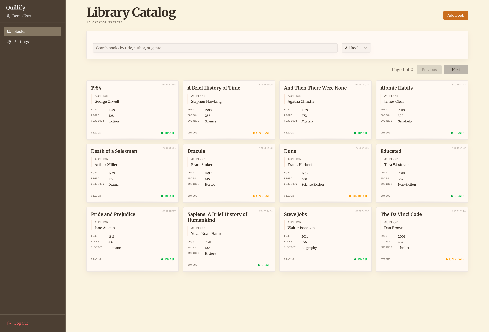

# Quillify

Quillify turns a scattered TBR into a focused personal library. Add books, filter the shelf, mark
finished reads, and track reading statistics without turning the process into a second hobby.



## Features

- Personal library with search, genre and status filters, sorting, and 12-book pagination
- Shared, validated add and edit flows
- To Read, Reading, Paused, Finished, and Did Not Finish states with reread history
- Optional reading dates, format, ownership, and corrected historical periods
- Dashboard statistics, reading-status totals, top genres, publication range, and recent additions
- Email and password authentication with optional email verification
- Rate-limited password reset and verification links
- Responsive navigation with a keyboard-resizable desktop sidebar

## Requirements

- Node.js 20.9 or newer. Current LTS recommended.
- pnpm 10
- PostgreSQL

## Setup

```bash
pnpm install
cp .env.example .env
pnpm db:migrate
pnpm dev
```

`pnpm db:migrate` creates the `quillify` PostgreSQL schema before applying committed migrations.
Open `http://localhost:3000` after the development server starts.

Required environment variables:

```dotenv
AUTH_SECRET=replace_with_a_random_secret
DATABASE_URL=postgresql://postgres:@localhost:5432/postgres
MAIL_FROM_ADDRESS=noreply@example.com
MAIL_FROM_NAME=Quillify
MAILTRAP_API_KEY=replace_with_mailtrap_key
NEXT_PUBLIC_APP_URL=http://localhost:3000
CRON_SECRET=replace_with_a_random_secret
```

Generate secrets with:

```bash
openssl rand -base64 32
```

## Commands

| Command             | Purpose                                                   |
| ------------------- | --------------------------------------------------------- |
| `pnpm dev`          | Start the Turbopack development server                    |
| `pnpm build`        | Create a production build                                 |
| `pnpm start`        | Run the production build                                  |
| `pnpm lint`         | Run ESLint                                                |
| `pnpm typecheck`    | Run TypeScript without emitting files                     |
| `pnpm test`         | Run Vitest once                                           |
| `pnpm test:watch`   | Run Vitest in watch mode                                  |
| `pnpm test:e2e`     | Run Playwright against an already-running app             |
| `pnpm format:check` | Check Prettier formatting                                 |
| `pnpm format:write` | Apply Prettier formatting                                 |
| `pnpm db:generate`  | Generate a new append-only migration after schema changes |
| `pnpm db:migrate`   | Create the schema and apply committed migrations          |
| `pnpm db:push`      | Push the schema directly. Development only.               |
| `pnpm db:studio`    | Open Drizzle Studio                                       |
| `pnpm db:seed`      | Create or refresh the demo account and sample library     |

Playwright does not start the app. Set `PLAYWRIGHT_BASE_URL` when the existing server is not at
`http://127.0.0.1:3000`.

## Architecture

- Next.js 16 App Router and React 19
- TypeScript with strict mode and `noUncheckedIndexedAccess`
- tRPC 11 and TanStack Query for typed server and client data access
- Drizzle ORM and PostgreSQL under the `quillify` schema
- Auth.js 5 credentials provider with JWT sessions
- Tailwind CSS 4, shadcn/ui, Radix UI, and Lucide icons
- react-hook-form and Zod for forms
- Mailtrap for transactional email
- Vitest for unit tests and Playwright for browser coverage

Server Components use `api` and `HydrateClient` from `@/trpc/server`. Client Components use hooks
from `@/trpc/react`. Keep `AppRouter` imports in client code type-only so PostgreSQL and other Node.js
modules are never bundled for the browser.

## Documentation

- [API architecture](./docs/API.md)
- [Routes and procedures](./docs/ROUTES.md)
- [Database schema](./docs/SCHEMA.md)

## License

BSD 3-Clause. See [LICENSE](./LICENSE).
